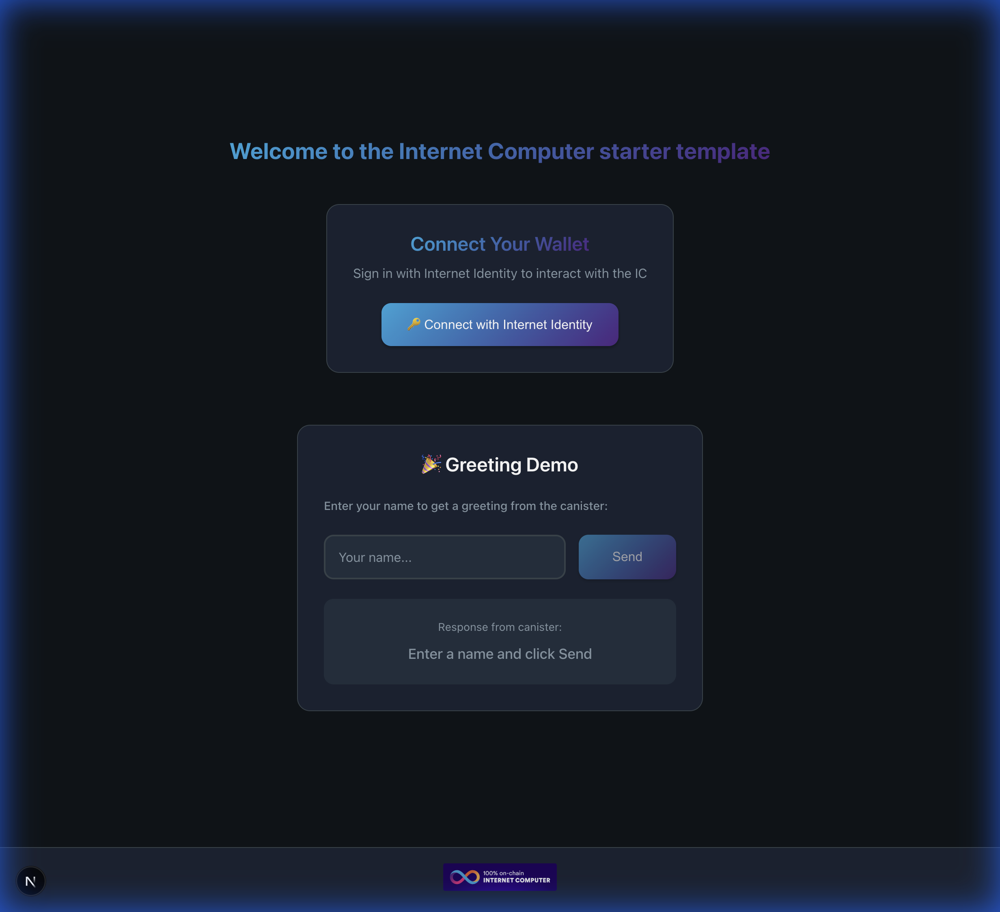
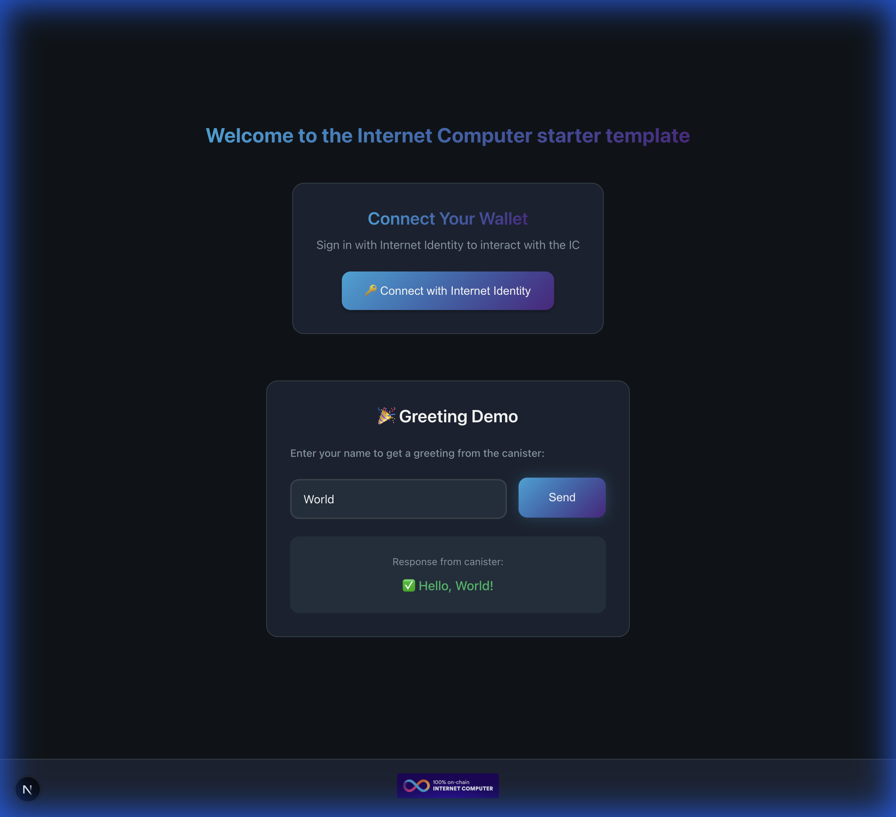

# Internet Computer - Rust + Next.js Template

A modern, full-stack template for building decentralized applications on the **Internet Computer** using **Rust** backend canisters and **Next.js 16** frontend, powered by **IC Reactor v3** for type-safe canister interactions.





## 🚀 Quick Start

### Option 1: Use GitHub Template (Recommended)

Click the **"Use this template"** button at the top of this repository, then:

```bash
git clone https://github.com/YOUR_USERNAME/YOUR_NEW_REPO.git
cd YOUR_NEW_REPO
npm install
```

### Option 2: Using degit (No Git History)

```bash
# Clone the template
npx degit b3hr4d/ic-rust-nextjs my-icp-app

# Navigate to project
cd my-icp-app

# Install dependencies
npm install
```

### Option 3: Using Git Clone

```bash
# Clone with full history
git clone https://github.com/b3hr4d/ic-rust-nextjs.git my-icp-app
cd my-icp-app

# Remove original git history and start fresh
rm -rf .git
git init

# Install dependencies
npm install
```

> 💡 **Tip**: After cloning, update the project name in `package.json`, `dfx.json`, and `Cargo.toml` to match your project.

## ✨ Features

- 🚀 **Next.js 16** with React 19 & Turbopack
- 🦀 **Rust Backend** with IC CDK
- ⚡ **IC Reactor v3** - Type-safe canister interactions with TanStack Query caching
- 🔐 **Internet Identity** - Built-in authentication support
- 🎨 **Modern Dark UI** - Beautiful ICP-themed design

## 📁 Project Structure

```
├── backend/             # Rust canister code
│   └── hello/           # Hello world canister
│       ├── Cargo.toml   # Rust dependencies
│       └── src/
│           └── lib.rs   # Canister logic
├── src/
│   ├── components/      # React components (Login, Greeting)
│   ├── declarations/    # Auto-generated canister interface
│   ├── lib/
│   │   ├── reactor.ts   # IC Reactor setup (ClientManager + Reactor)
│   │   └── hooks.ts     # Typed React hooks for canister calls
│   ├── pages/           # Next.js pages
│   └── styles/          # CSS styles
├── dfx.json             # Canister configuration
└── package.json
```

## 🔧 Prerequisites

Before getting started, make sure you have the following installed:

1. **[Node.js](https://nodejs.org/)** (v18+)
2. **[DFINITY Canister SDK (dfx)](https://internetcomputer.org/docs/current/developer-docs/getting-started/install/)**
   ```bash
   sh -ci "$(curl -fsSL https://internetcomputer.org/install.sh)"
   ```
3. **[Rust](https://www.rust-lang.org/tools/install)**
   ```bash
   curl --proto '=https' --tlsv1.2 -sSf https://sh.rustup.rs | sh
   rustup target add wasm32-unknown-unknown
   ```

## 🛠️ Installation & Setup

### 1. Install Dependencies

```bash
# Install Node.js dependencies
npm install

# Install Rust tools for canister development
npm run candid:install    # Install candid-extractor
npm run ic-wasm:install   # Install ic-wasm optimizer
```

### 2. Start Local Development

```bash
# Terminal 1: Start local IC replica
npm run dfx:start

# Terminal 2: Deploy canisters (including Internet Identity)
dfx deploy

# Terminal 3: Start Next.js development server
npm run dev
```

Open [http://localhost:3000](http://localhost:3000) to see the app.

## 🔧 IC Reactor v3 Usage

This template uses IC Reactor v3's new patterns for type-safe canister interactions:

### Reactor Setup (`src/lib/reactor.ts`)

```typescript
import { ClientManager, Reactor } from "@ic-reactor/react"
import { QueryClient } from "@tanstack/react-query"

const queryClient = new QueryClient()
const clientManager = new ClientManager({ queryClient, withProcessEnv: true })

export const helloReactor = new Reactor<_SERVICE>({
  clientManager,
  idlFactory,
  canisterId
})
```

### Generated Hooks (`src/lib/hooks.ts`)

```typescript
import { createActorHooks, createAuthHooks } from "@ic-reactor/react"

// Authentication hooks
export const { useAuth, useAgentState } = createAuthHooks(clientManager)

// Canister hooks
export const { useActorQuery, useActorMutation } =
  createActorHooks(helloReactor)
```

### Component Usage

```typescript
import { useActorMutation } from "lib/hooks"

function Greeting() {
  const { mutate, data, isPending } = useActorMutation({
    functionName: "greet"
  })

  return (
    <button onClick={() => mutate(["World"])}>
      {isPending ? "Loading..." : data || "Click to greet"}
    </button>
  )
}
```

## 📦 Available Scripts

| Script                 | Description                      |
| ---------------------- | -------------------------------- |
| `npm run dev`          | Start Next.js development server |
| `npm run build`        | Build Next.js for production     |
| `npm run dfx:start`    | Start local IC replica           |
| `npm run dfx:stop`     | Stop local IC replica            |
| `dfx deploy`           | Deploy all canisters             |
| `npm run dfx:generate` | Generate TypeScript declarations |

## 🌐 Deploy to IC Mainnet

```bash
# Deploy to mainnet (requires cycles)
dfx deploy --network=ic
```

## 🔗 Template Variants

This template has multiple variants for different use cases:

| Branch                                                                           | Stack                    | Description                        |
| -------------------------------------------------------------------------------- | ------------------------ | ---------------------------------- |
| **main**                                                                         | Rust + Next.js           | Default template with Rust backend |
| **[motoko](https://github.com/b3hr4d/ic-rust-nextjs/tree/motoko)**               | Motoko + Next.js         | Motoko backend for easier learning |
| **[motoko_todo](https://github.com/b3hr4d/ic-rust-nextjs/tree/motoko_todo)**     | Motoko + Next.js         | Todo app example                   |
| **[radix-ui](https://github.com/b3hr4d/ic-rust-nextjs/tree/radix-ui)**           | Rust + Next.js + RadixUI | With RadixUI components            |
| **[stable_memory](https://github.com/b3hr4d/ic-rust-nextjs/tree/stable_memory)** | Rust + Next.js           | Using stable memory patterns       |

Use degit to clone a specific branch:

```bash
npx degit b3hr4d/ic-rust-nextjs#motoko my-motoko-app
npx degit b3hr4d/ic-rust-nextjs#radix-ui my-radix-app
```

## 🎨 Customizing the Template

### Rename Your Project

After cloning, update these files with your project name:

1. **`package.json`** - Update `name` and `description`
2. **`dfx.json`** - Rename canister from `hello` to your name
3. **`backend/hello/Cargo.toml`** - Update package name
4. **`src/declarations/`** - Run `npm run dfx:generate` to regenerate

### Add New Canisters

1. Create a new directory in `backend/your_canister/`
2. Add canister configuration to `dfx.json`
3. Create a new Reactor in `src/lib/reactor.ts`
4. Generate hooks with `createActorHooks()`

## ❓ Troubleshooting

### Common Issues

**dfx command not found**

```bash
# Re-run the install script
sh -ci "$(curl -fsSL https://internetcomputer.org/install.sh)"
```

**Rust wasm32 target not found**

```bash
rustup target add wasm32-unknown-unknown
```

**Port 4943 already in use**

```bash
npm run dfx:stop
npm run dfx:start
```

**Candid generation fails**

```bash
npm run candid:install
npm run dfx:generate
```

## 📚 Resources

- [IC Reactor Documentation](https://b3pay.github.io/ic-reactor/)
- [DFINITY SDK Documentation](https://internetcomputer.org/docs/)
- [Rust on IC](https://internetcomputer.org/docs/current/developer-docs/backend/rust/)
- [Next.js](https://nextjs.org/)
- [Internet Identity](https://identity.ic0.app/)

## 🤝 Contributing

Contributions are welcome! Please feel free to submit a Pull Request.

## 📄 License

MIT License - see [LICENSE](LICENSE) for details.

---

<p align="center">
  <b>Built with ❤️ for the Internet Computer community</b>
</p>
