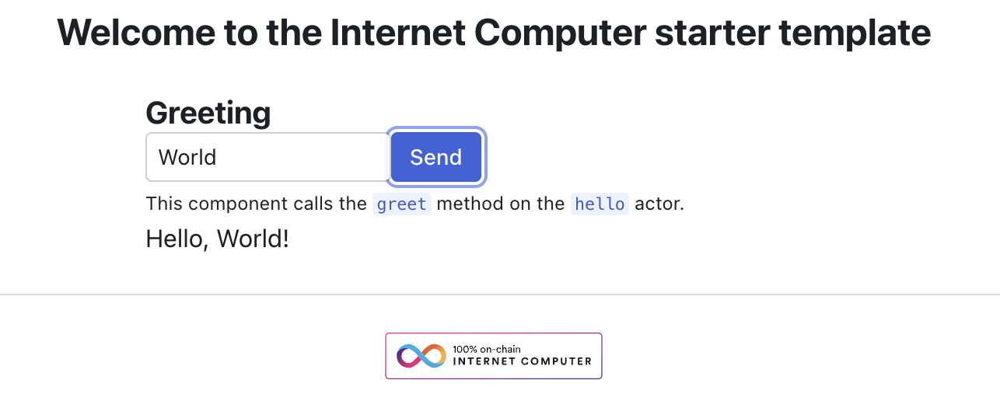

# Internet Computer - Rust + Next.js Template

A modern, full-stack template for building decentralized applications on the **Internet Computer** using **Rust** backend canisters and **Next.js 16** frontend, powered by **IC Reactor v3** for type-safe canister interactions.




## ✨ Features

- 🚀 **Next.js 16** with React 19 & Turbopack
- 🦀 **Rust Backend** with IC CDK
- ⚡ **IC Reactor v3** - Type-safe canister interactions with TanStack Query caching
- 🔐 **Internet Identity** - Built-in authentication support
- 🎨 **Modern Dark UI** - Beautiful ICP-themed design

## 📁 Project Structure

```
├── backend/             # Rust canister code
├── src/
│   ├── components/      # React components (Login, Greeting)
│   ├── declarations/    # Auto-generated canister interface
│   ├── lib/
│   │   ├── reactor.ts   # IC Reactor setup (ClientManager + Reactor)
│   │   └── hooks.ts     # Typed React hooks for canister calls
│   ├── pages/           # Next.js pages
│   └── styles/          # CSS styles
├── dfx.json             # Canister configuration
└── package.json
```

## 🔧 IC Reactor v3 Usage

This template uses IC Reactor v3's new patterns for type-safe canister interactions:

### Reactor Setup (`src/lib/reactor.ts`)

```typescript
import { ClientManager, Reactor } from "@ic-reactor/react"
import { QueryClient } from "@tanstack/react-query"

const queryClient = new QueryClient()
const clientManager = new ClientManager({ queryClient, withProcessEnv: true })

export const helloReactor = new Reactor<_SERVICE>({
  clientManager,
  idlFactory,
  canisterId
})
```

### Generated Hooks (`src/lib/hooks.ts`)

```typescript
import { createActorHooks, createAuthHooks } from "@ic-reactor/react"

// Authentication hooks
export const { useAuth, useAgentState } = createAuthHooks(clientManager)

// Canister hooks
export const { useActorQuery, useActorMutation } =
  createActorHooks(helloReactor)
```

### Component Usage

```typescript
import { useActorMutation } from "lib/hooks"

function Greeting() {
  const { mutate, data, isPending } = useActorMutation({
    functionName: "greet"
  })

  return (
    <button onClick={() => mutate(["World"])}>
      {isPending ? "Loading..." : data || "Click to greet"}
    </button>
  )
}
```

## 🚀 Getting Started

### Prerequisites

1. [DFINITY Canister SDK (dfx)](https://internetcomputer.org/docs/current/developer-docs/getting-started/install/)
2. [Node.js](https://nodejs.org/) (v18+)
3. [Rust](https://www.rust-lang.org/tools/install)

### Installation

```bash
# Install dependencies
npm install

# Install Rust tools (optional, for building backend)
npm run candid:install
npm run ic-wasm:install
```

### Running Locally

```bash
# Start local IC replica
npm run dfx:start

# Deploy canisters (including Internet Identity)
dfx deploy

# Start Next.js development server
npm run dev
```

Open [http://localhost:3000](http://localhost:3000) to see the app.

### Deploy to IC Mainnet

```bash
dfx deploy --network=ic
```

## 🔗 Other Branches

- **Motoko + Next.js**: [motoko](https://github.com/b3hr4d/ic-rust-nextjs/tree/motoko)
- **Todo App (Motoko)**: [motoko_todo](https://github.com/b3hr4d/ic-rust-nextjs/tree/motoko_todo)
- **RadixUI + Rust**: [radix-ui](https://github.com/b3hr4d/ic-rust-nextjs/tree/radix-ui)
- **Stable Memory**: [stable_memory](https://github.com/b3hr4d/ic-rust-nextjs/tree/stable_memory)

## 📚 Resources

- [IC Reactor Documentation](https://b3pay.github.io/ic-reactor/)
- [DFINITY SDK Documentation](https://internetcomputer.org/docs/)
- [Rust on IC](https://internetcomputer.org/docs/current/developer-docs/backend/rust/)
- [Next.js](https://nextjs.org/)
- [Internet Identity](https://identity.ic0.app/)

## 📄 License

MIT License - see [LICENSE](LICENSE) for details.
